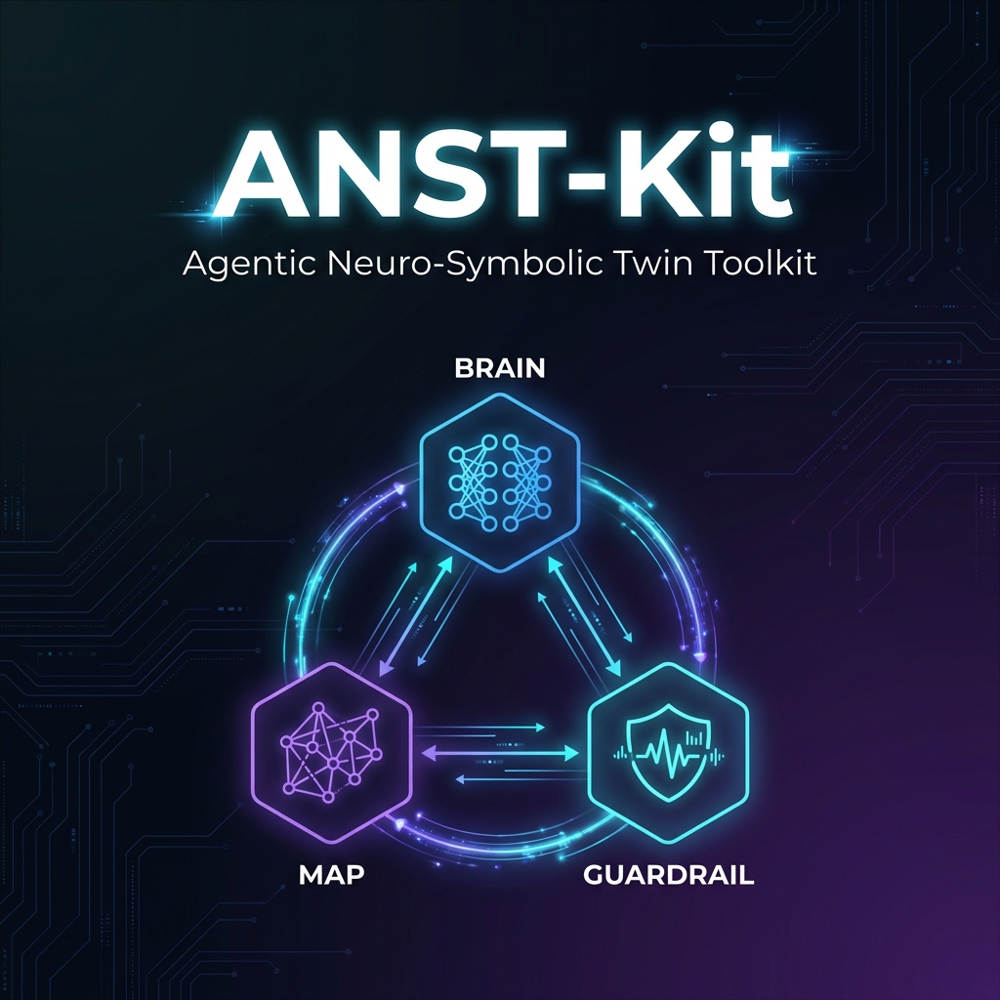
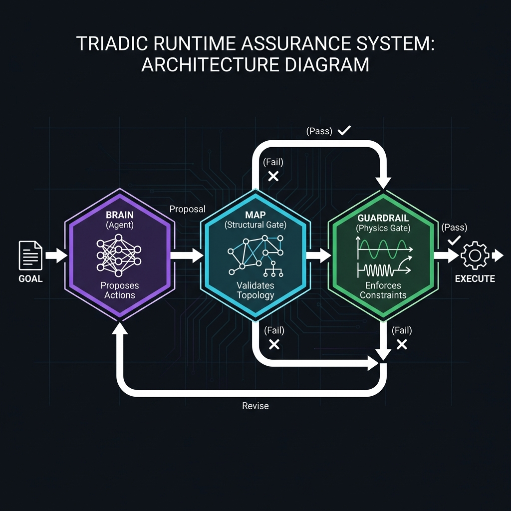
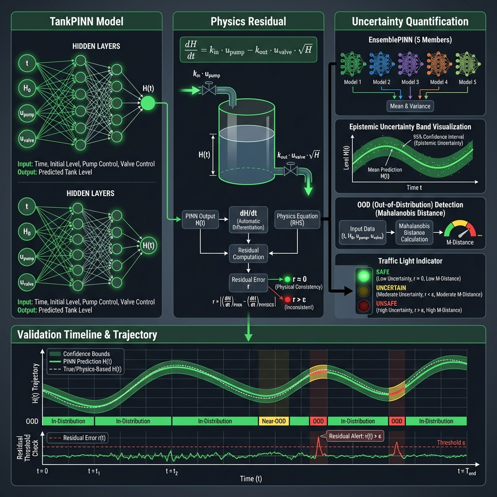
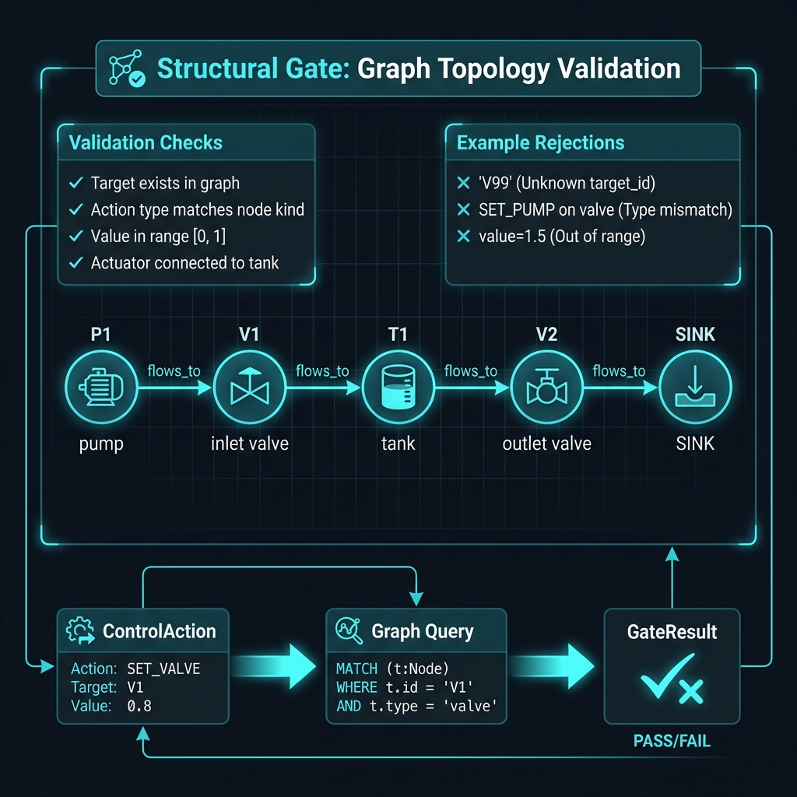
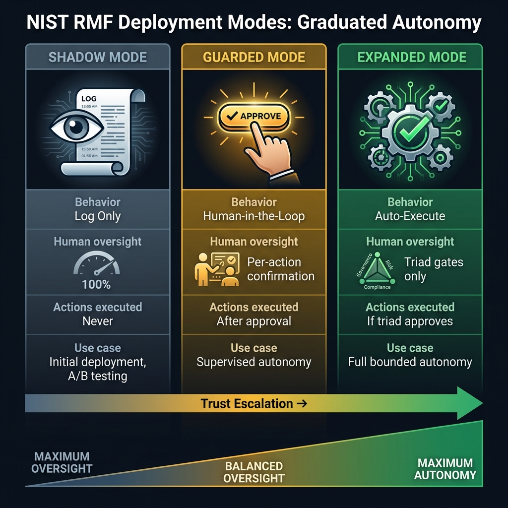
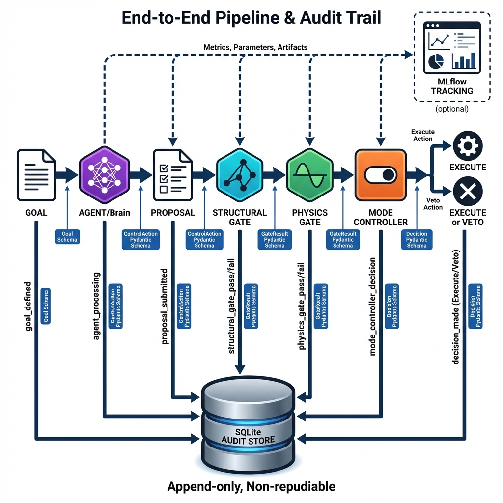

# ANST-Kit

<p align="center">
  
</p>

<p align="center">
  <strong>Triadic Runtime Assurance for Bounded Industrial Autonomy</strong>
</p>

<p align="center">
  <a href="https://www.python.org/downloads/"></a>
  <a href="https://github.com/hadijannat/ANST-Kit/actions/workflows/ci.yml"></a>
  <a href="LICENSE"></a>
  <a href="#"></a>
</p>

---

> **Research scaffold** — An untrusted agent (Brain) proposes actions that are validated by a structural gate (Map) and physics gate (Guardrail) before execution.

---

## 🎯 Overview

ANST-Kit implements a **triadic runtime assurance system** that enables safe agentic control of physical systems. The architecture ensures that AI-generated control actions are validated against both **structural topology** and **physics constraints** before execution.

### Key Capabilities

| Feature | Description |
|---------|-------------|
| **Triadic Verification** | Propose → Verify → Execute pattern with iterative refinement |
| **Physics-Informed Guardrail** | PINN-based constraint checking with ensemble uncertainty quantification |
| **GraphRAG-Ready Grounding** | Pluggable graph backends (NetworkX, Microsoft GraphRAG) |
| **Append-Only Audit Trail** | SQLite-backed event store for non-repudiation |
| **NIST RMF Deployment Modes** | Shadow, Guarded, and Expanded autonomy levels |
| **Reproducible Experiments** | DVC pipelines + MLflow tracking |

---

## 🏗️ System Architecture

<p align="center">
  
</p>

The triadic architecture enforces a strict **propose → verify → execute** loop:

1. **Brain (Agent)** proposes control actions based on a goal and current state
2. **Map (Structural Gate)** validates that targets exist and actions match equipment types
3. **Guardrail (Physics Gate)** simulates the action via PINN to ensure physical safety
4. On **failure**, the agent receives feedback and revises its proposal
5. On **success**, actions proceed to the Mode Controller for execution

| Component | Purpose | Implementation |
|-----------|---------|----------------|
| **Brain** | Generates action proposals from goals | `DemoAgent` (LLM-replaceable) |
| **Map** | Validates structural topology | `PlantGraph` + `GraphRAGBackend` |
| **Guardrail** | Enforces physics constraints | `TankPINN` + `EnsemblePINN` |

---

## ⚡ The Physics Guardrail

<p align="center">
  
</p>

The physics gate uses a **Physics-Informed Neural Network (PINN)** to enforce safety constraints:

### TankPINN Model

```
Input:  (t, H₀, u_pump, u_valve)
Output: H(t) — predicted tank level over time horizon
```

### Physics Residual

The ODE governing the tank dynamics:

```
dH/dt = k_in · u_pump - k_out · u_valve · √H
```

The PINN is trained to minimize the physics residual `r ≈ 0`, ensuring predictions are physically consistent.

### Uncertainty Quantification

- **EnsemblePINN**: 5 independently trained models provide epistemic uncertainty via disagreement
- **OOD Detection**: Mahalanobis distance flags out-of-distribution inputs
- **Safety Traffic Light**: Green (safe), Yellow (uncertain), Red (unsafe)

---

## 🗺️ Structural Validation

<p align="center">
  
</p>

The structural gate prevents **hallucinated assets** and **invalid commands**:

### Validation Checks

| Check | Description |
|-------|-------------|
| ✓ Target Exists | Asset ID must exist in the plant graph |
| ✓ Type Match | Action type must match equipment kind (pump → SET_PUMP_SPEED) |
| ✓ Value Range | Setpoints must be within [0, 1] |
| ✓ Connectivity | Actuator must have path to/from controlled unit |

### Example Rejections

```python
# ✗ Unknown target_id 'V99'
ControlAction(type=SET_VALVE_OPENING, target_id="V99", value=0.5)

# ✗ Type mismatch: SET_PUMP on valve
ControlAction(type=SET_PUMP_SPEED, target_id="V1", value=0.5)

# ✗ Out of range
ControlAction(type=SET_PUMP_SPEED, target_id="P1", value=1.5)
```

---

## 🎚️ Deployment Modes

<p align="center">
  
</p>

ANST-Kit supports **graduated autonomy** per NIST AI Risk Management Framework:

| Mode | Human Oversight | Execution | Use Case |
|------|-----------------|-----------|----------|
| **Shadow** | 100% | Never | Initial deployment, A/B testing |
| **Guarded** | Per-action confirmation | After approval | Supervised autonomy |
| **Expanded** | Triad gates only | If triad approves | Full bounded autonomy |

---

## 📊 End-to-End Pipeline

<p align="center">
  
</p>

### Audit Trail

Every decision is logged to an **append-only SQLite store** for non-repudiation:

| Event Type | Trigger |
|------------|---------|
| `proposal_submitted` | Agent generates actions |
| `structural_gate_pass/fail` | Map validates topology |
| `physics_gate_pass/fail` | Guardrail checks physics |
| `decision_made` | Final approval/rejection |

---

## 🚀 Quickstart

### Installation

```bash
git clone https://github.com/hadijannat/ANST-Kit.git
cd ANST-Kit
python -m venv .venv && source .venv/bin/activate
pip install -e ".[services,tracking]"
```

### Run the Demo

```bash
# Single propose-verify-execute cycle
python -m anstkit run --goal "increase throughput" --seed 7
```

### Run Benchmarks

```bash
# Reproducibility benchmark (500 trials)
python -m anstkit benchmark --n 500 --seed 7

# Ablation study comparing configurations
python -m anstkit ablation --n 500 --seed 7 --output metrics/ablation.json
```

### Train the PINN (Optional)

```bash
python -m anstkit train-pinn --steps 3000 --seed 7
```

---

## 📈 Ablation Study Results

Comparison of triad configurations (500 trials, seed=7):

| Configuration | Unsafe Rate | Approval Rate | Struct Vetoes | Physics Vetoes |
|--------------|-------------|---------------|---------------|----------------|
| **Brain Only** | 40.0% | 100% | — | — |
| **Brain + Structural** | 18.8% | 59.8% | 40.2% | — |
| **Brain + Physics** | 12.8% | 41.2% | — | 58.8% |
| **Full Triad** | **8.8%** | 35.6% | 38.6% | 25.8% |

> **Key Finding**: The full triad reduces the unsafe execution rate from 40% (unguarded) to 8.8%, with both gates contributing complementary safety layers.

---

## 🔌 API Reference

Start the FastAPI service:

```bash
uvicorn anstkit.services.orchestrator_svc:app --host 0.0.0.0 --port 8000
```

### Endpoints

| Method | Path | Description |
|--------|------|-------------|
| `GET` | `/health` | Service health check |
| `POST` | `/propose` | Submit goal for triad evaluation |

### Example Request

```bash
curl -X POST http://localhost:8000/propose \
  -H "Content-Type: application/json" \
  -d '{
    "goal": "increase throughput",
    "state": {"tank_level": 0.5, "pump_speed": 0.5, "valve_opening": 0.5}
  }'
```

---

## 📁 Repository Structure

```
ANST-Kit/
├── src/anstkit/
│   ├── __main__.py          # CLI entry point
│   ├── schemas.py           # Pydantic data models
│   ├── orchestrator.py      # Triad coordination loop
│   ├── agent_demo.py        # Demo agent with intentional hallucinations
│   ├── plant_graph.py       # Legacy structural gate
│   ├── physics_pinn.py      # PINN guardrail + ensemble UQ
│   ├── tracking.py          # MLflow experiment tracking
│   ├── evaluation/          # Metrics, scenarios, ablation runner
│   ├── graph/               # Backend abstraction (NetworkX, GraphRAG)
│   ├── ingestion/           # DEXPI P&ID parser
│   ├── audit/               # Append-only event store
│   ├── services/            # FastAPI orchestrator service
│   └── governance/          # NIST RMF deployment modes
├── assets/                  # Technical diagrams
├── models/                  # Trained PINN weights
├── metrics/                 # Benchmark and ablation results
├── tests/                   # 71 unit tests
├── Dockerfile               # Container build
├── docker-compose.yaml      # Multi-service deployment
└── dvc.yaml                 # Reproducible pipeline
```

---

## 🐳 Deployment

### Docker Compose

```bash
docker-compose up -d
curl http://localhost:8000/health
open http://localhost:5000  # MLflow UI
```

### DVC Pipeline

```bash
dvc init
dvc repro              # Run full pipeline (train → benchmark → ablation)
dvc metrics show       # View metrics
```

---

## 🔧 Extending ANST-Kit

### Replace Demo Agent with LLM

```python
from anstkit.orchestrator import TriadOrchestrator

class LLMAgent:
    def propose(self, goal: str, state: PlantState) -> Proposal:
        # Call your LLM here
        ...

orch = TriadOrchestrator(agent=LLMAgent(), plant=plant, pinn=pinn, state=state)
```

### Use GraphRAG Backend

```python
from anstkit.graph import GraphRAGBackend, GraphRAGConfig

config = GraphRAGConfig(index_dir="./graphrag_index", enable_semantic_search=True)
backend = GraphRAGBackend(config)
backend.build_index()  # Build semantic index from topology
```

### Production PINN Integration

Replace `TankPINN` with asset-grade PINNs from:
- [DeepXDE](https://github.com/lululxvi/deepxde)
- [NVIDIA Modulus](https://developer.nvidia.com/modulus)

---

## 📖 Citation

```bibtex
@software{anstkit2025,
  title = {ANST-Kit: Agentic Neuro-Symbolic Twin Toolkit},
  year = {2025},
  url = {https://github.com/hadijannat/ANST-Kit}
}
```

---

## 📄 License

MIT License — see [LICENSE](LICENSE).
