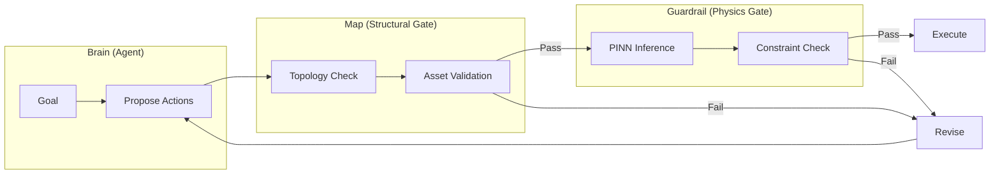

# ANST-Kit

**Agentic Neuro-Symbolic Twin Toolkit**

[](https://www.python.org/downloads/)
[](#)
[](LICENSE)

A **triadic runtime assurance system** for bounded industrial autonomy. An untrusted agent (Brain) proposes actions that are validated by a structural gate (Map) and physics gate (Guardrail) before execution.

```
┌─────────────────────────────────────────────────────────────────┐
│                        TRIAD ARCHITECTURE                       │
├─────────────────────────────────────────────────────────────────┤
│                                                                 │
│    ┌──────────┐      ┌──────────┐      ┌──────────┐            │
│    │  BRAIN   │─────▶│   MAP    │─────▶│GUARDRAIL │───▶ Execute│
│    │ (Agent)  │      │ (Graph)  │      │  (PINN)  │    or Veto │
│    └──────────┘      └──────────┘      └──────────┘            │
│         │                 │                 │                   │
│    Proposes          Validates         Validates               │
│    Actions           Topology          Physics                 │
│                                                                 │
└─────────────────────────────────────────────────────────────────┘
```

> **Research scaffold** — not intended for real industrial control systems.

---

## Features

- **Triadic Runtime Assurance**: Propose → Verify → Execute pattern with iterative refinement
- **Physics-Informed Guardrail**: PINN-based constraint checking with ensemble uncertainty quantification
- **GraphRAG-Ready Grounding**: Pluggable graph backends (NetworkX, Microsoft GraphRAG)
- **Append-Only Audit Trail**: SQLite-backed event store for non-repudiation
- **NIST RMF Deployment Modes**: Shadow, Guarded, and Expanded autonomy levels
- **Reproducible Experiments**: DVC pipelines + MLflow tracking
- **Production-Ready**: Docker Compose deployment with health checks

---

## Architecture



| Component | Purpose | Implementation |
|-----------|---------|----------------|
| **Brain** | Generates action proposals from goals | `DemoAgent` (LLM-replaceable) |
| **Map** | Validates structural topology | `PlantGraph` + `GraphRAGBackend` |
| **Guardrail** | Enforces physics constraints | `TankPINN` + `EnsemblePINN` |

---

## Quickstart

### Installation

```bash
# Clone and install
git clone https://github.com/hadijannat/ANST-Kit.git
cd ANST-Kit
python -m venv .venv && source .venv/bin/activate
pip install -e ".[services,tracking]"
```

### Run the Demo

```bash
# Single propose-verify-execute cycle
python -m anstkit run --goal "increase throughput" --seed 7
```

### Run Benchmarks

```bash
# Reproducibility benchmark (500 trials)
python -m anstkit benchmark --n 500 --seed 7

# Ablation study comparing configurations
python -m anstkit ablation --n 500 --seed 7 --output metrics/ablation.json
```

### Train the PINN (Optional)

```bash
python -m anstkit train-pinn --steps 3000 --seed 7
```

---

## Ablation Study Results

Comparison of triad configurations (500 trials, seed=7):

| Configuration | Unsafe Rate | Approval Rate | Struct Vetoes | Physics Vetoes |
|--------------|-------------|---------------|---------------|----------------|
| **Brain Only** | 40.0% | 100% | — | — |
| **Brain + Structural** | 18.8% | 59.8% | 40.2% | — |
| **Brain + Physics** | 12.8% | 41.2% | — | 58.8% |
| **Full Triad** | **8.8%** | 35.6% | 38.6% | 25.8% |

**Key Finding**: The full triad reduces the unsafe execution rate from 40% (unguarded) to 8.8%, with both gates contributing complementary safety layers.

---

## API Reference

Start the FastAPI service:

```bash
uvicorn anstkit.services.orchestrator_svc:app --host 0.0.0.0 --port 8000
```

### Endpoints

| Method | Path | Description |
|--------|------|-------------|
| `GET` | `/health` | Service health check |
| `POST` | `/propose` | Submit goal for triad evaluation |

### Example Request

```bash
curl -X POST http://localhost:8000/propose \
  -H "Content-Type: application/json" \
  -d '{
    "goal": "increase throughput",
    "state": {"tank_level": 0.5, "pump_speed": 0.5, "valve_opening": 0.5}
  }'
```

---

## Repository Structure

```
ANST-Kit/
├── src/anstkit/
│   ├── __main__.py          # CLI entry point
│   ├── schemas.py           # Pydantic data models
│   ├── orchestrator.py      # Triad coordination loop
│   ├── agent_demo.py        # Demo agent with intentional hallucinations
│   ├── plant_graph.py       # Legacy structural gate
│   ├── physics_pinn.py      # PINN guardrail + ensemble UQ
│   ├── tracking.py          # MLflow experiment tracking
│   ├── evaluation/          # Metrics, scenarios, ablation runner
│   ├── graph/               # Backend abstraction (NetworkX, GraphRAG)
│   ├── ingestion/           # DEXPI P&ID parser
│   ├── audit/               # Append-only event store
│   ├── services/            # FastAPI orchestrator service
│   └── governance/          # NIST RMF deployment modes
├── models/                  # Trained PINN weights
├── metrics/                 # Benchmark and ablation results
├── configs/                 # DVC parameter files
├── tests/                   # 71 unit tests
├── Dockerfile               # Container build
├── docker-compose.yaml      # Multi-service deployment
└── dvc.yaml                 # Reproducible pipeline
```

---

## Deployment

### Docker Compose

```bash
# Build and start services
docker-compose up -d

# Check health
curl http://localhost:8000/health

# View MLflow UI
open http://localhost:5000
```

### DVC Pipeline

```bash
# Initialize DVC
dvc init

# Run full pipeline (train → benchmark → ablation)
dvc repro

# View metrics
dvc metrics show
```

---

## Deployment Modes

ANST-Kit supports graduated autonomy per NIST AI RMF:

| Mode | Behavior | Use Case |
|------|----------|----------|
| **Shadow** | Log decisions, never execute | Initial deployment, A/B testing |
| **Guarded** | Execute only with human confirmation | Supervised autonomy |
| **Expanded** | Auto-execute approved actions | Full autonomy within triad bounds |

---

## Extending ANST-Kit

### Replace Demo Agent with LLM

```python
from anstkit.orchestrator import TriadOrchestrator

class LLMAgent:
    def propose(self, goal: str, state: PlantState) -> Proposal:
        # Call your LLM here
        ...

orch = TriadOrchestrator(agent=LLMAgent(), plant=plant, pinn=pinn, state=state)
```

### Use GraphRAG Backend

```python
from anstkit.graph import GraphRAGBackend, GraphRAGConfig

config = GraphRAGConfig(index_dir="./graphrag_index", enable_semantic_search=True)
backend = GraphRAGBackend(config)
backend.build_index()  # Build semantic index from topology
```

### Production PINN Integration

Replace `TankPINN` with asset-grade PINNs from:
- [DeepXDE](https://github.com/lululxvi/deepxde)
- [NVIDIA Modulus](https://developer.nvidia.com/modulus)

---

## Citation

```bibtex
@software{anstkit2025,
  title = {ANST-Kit: Agentic Neuro-Symbolic Twin Toolkit},
  year = {2025},
  url = {https://github.com/hadijannat/ANST-Kit}
}
```

---

## License

MIT License — see [LICENSE](LICENSE).
